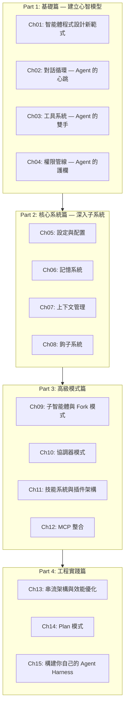

# 《御輿：解碼 Agent Harness》架構深度分析報告

> **來源**: [lintsinghua/claude-code-book](https://github.com/lintsinghua/claude-code-book) (3.2k ⭐, 697 forks)
> **分析日期**: 2026-05-09
> **分析人**: N7 (Hermes Agent)
> **文件規模**: 42 萬字，15 章 + 附錄 A-D，CC BY-NC-SA 4.0

---

## 一、專案定位與核心主張

### 1.1 專案概述

《御輿》（The Chariot Book）是一部以 Claude Code（Anthropic 的終端 AI 程式設計智能體）為分析標的，系統性拆解 **Agent Harness** 架構設計原理的技術專著。作者取《周禮·考工記》「一器而工聚焉者，車為多」之意，以古代馬車的精密機械工程類比現代 AI Agent 的運行時框架。

**核心隱喻對照表**：

| 古代馬車 | 含義 | Agent Harness 對應 |
|:--------:|------|:------------------:|
| **輿** | 車廂，承載核心結構 | **Harness 運行時** — 承載 LLM 的工程框架 |
| **轅** | 車轅，定方向、傳動力 | **對話循環** — 驅動 Agent 前行的主迴圈 |
| **輻** | 車輪輻條，連接軸心與外圈 | **工具系統** — 連接 LLM 與外部世界的橋樑 |
| **軎轄** | 固定車軸的銷釘 | **權限管線** — 約束 Agent 行為的安全機制 |
| **軾** | 車前橫木 | **鉤子系統** — 生命週期中的擴展點 |
| **御** | 駕馭車夫技藝 | **架構認知** — 理解並掌控 Agent 系統的能力 |

### 1.2 核心主張

> **Agent Harness 不是 SDK，不是 API 封裝，更不是簡單的 Prompt Engineering，而是一套讓 LLM 真正「上路行駛」的工程基礎設施。**

本書明確區分了「簡單 API 封裝」與「Agent Harness」的本質差異，並以 Claude Code 超過 **51 萬行 TypeScript 程式碼**（1,884 個 `.ts` 檔案）的規模佐證此論點。

---

## 二、架構全景：四部分 × 五原則 × 六子系統

### 2.1 全書結構



### 2.2 五大設計原則（貫穿全書的紅線）

| # | 原則 | 設計決策 | 反模式警告 |
|---|------|----------|------------|
| 1 | **非同步串流優先** (Async Generator First) | `AsyncGenerator` 驅動對話主迴圈，`yield` 提供串流輸出、可取消性、背壓控制 | 避免使用回調地獄或一次性 Promise |
| 2 | **安全邊界內嵌** (Security at the Perimeter) | 四階段權限管線：可見性過濾 → 輸入校驗 → 權限決策 → 運行時防護 | 避免簡單白名單 |
| 3 | **快取感知設計** (Cache-Aware Architecture) | 系統 Prompt 穩定性、Fork 模式的位元組級繼承、訊息歷史不可變性 | 避免每次重建 Prompt |
| 4 | **漸進式能力擴展** (Progressive Capability) | 四級擴展模型：Tool → Skill → Plugin → MCP Server | 避免只有一級擴展 |
| 5 | **不可變狀態流轉** (Immutable State Flow) | Redux/Zustand 風格 Updater 函式，引用相等性檢查，訂閱/取消訂閱模式 | 避免全域可變狀態 |

---

## 三、核心架構拆解

### 3.1 對話循環 — Agent 的心臟（Ch02）

#### 3.1.1 AsyncGenerator 驅動的主迴圈

對話主迴圈是一個 `async function*` 定義的非同步生成器，實現了一個 `while(true)` 無限迴圈。每次迭代執行五個階段：

```
阶段 1: 狀態初始化（從 State 物件解構）
    ↓
阶段 2: 上下文預處理（七步管線）
    ↓
阶段 3: API 呼叫（串流接收）
    ↓
阶段 4: 工具呼叫檢測與執行
    ↓
阶段 5: 工具結果回填 → continue 回到阶段 1
```

#### 3.1.2 上下文預處理七步管線

| 步驟 | 名稱 | 策略 | 資訊損失 |
|------|------|------|----------|
| 1 | 工具結果預算 | 截斷/持久化到磁碟 | 低 |
| 2 | Snip 壓縮 | 直接截斷過長內容 | 高 |
| 3 | Microcompact | 輕量級快取感知壓縮 | 低 |
| 4 | Context Collapse | 細粒度折疊連續訊息 | 低 |
| 5 | 系統提示組裝 | 合併基礎 Prompt + 動態上下文 | 無 |
| 6 | Autocompact | 全量摘要壓縮（最後防線） | 中 |
| 7 | Token 阻斷檢查 | 超過硬性限制則快速失敗 | N/A |

> **關鍵設計洞察**：壓縮手段從輕量到重量排列，每一步先嘗試最小代價方案，延遲最「激進」的壓縮。

#### 3.1.3 十種終止原因

終止原因被精細劃分為三類：
- **正常終止**: `completed`
- **使用者主動終止**: `aborted_streaming`, `aborted_tools`
- **異常終止**: `max_turns`, `blocking_limit`, `prompt_too_long`, `model_error`, `stop_hook_prevented`, `hook_stopped`, `image_error`

#### 3.1.4 七種 Continue 路徑

| 路徑 | 觸發條件 | 恢復策略 |
|------|----------|----------|
| `next_turn` | 正常工具呼叫後 | 擴展訊息列表 |
| `max_output_tokens_recovery` | 輸出被截斷 | 注入恢復訊息（最多 3 次） |
| `max_output_tokens_escalate` | 首次截斷 | 提升輸出限制 |
| `reactive_compact_retry` | 上下文過長 | 響應式壓縮 |
| `collapse_drain_retry` | 上下文折疊溢出 | 優先於 reactive compact |
| `stop_hook_blocking` | Stop hook 錯誤 | 注入錯誤訊息讓模型修正 |
| `token_budget_continuation` | Token 預算警告 | 注入提醒訊息 |

### 3.2 工具系統 — Agent 的雙手（Ch03）

#### 3.2.1 工具類型契約

工具類型系統定義了所有工具必須遵循的介面，核心屬性包括：

- **並發安全聲明** (`isConcurrencySafe`): 標記是否可並行執行
- **中斷行為** (`interruptBehavior`): 使用者中斷時取消或阻塞
- **破壞性標記** (`isDestructive`): 識別不可逆操作
- **進度回調** (`onProgress`): 支援增量進度報告

#### 3.2.2 Fail-Closed 預設值

`buildTool` 工廠函式採用 **fail-closed** 預設策略：
- `isConcurrencySafe` 預設為 `false`
- `isReadOnly` 預設為 `false`
- `isDestructive` 預設為 `false`

> 新工具在顯式聲明安全性之前，系統假設最危險的情況。

#### 3.2.3 工具註冊中心特性

1. **條件註冊**: 通過 Feature Flag 控制，如 REPL 工具僅在內部版本可用
2. **延遲載入**: 部分工具使用動態 `import()` 避免循環依賴
3. **工具過濾**: 在發送給 LLM 前根據權限過濾，模型甚至無法「看到」被禁止的工具

### 3.3 權限管線 — 四階段縱深防禦（Ch04）

```
階段 1: 工具可見性過濾 → 模型無法看到被禁止的工具
    ↓
階段 2: 輸入校驗 (validateInput) → 拒絕格式不合法的參數
    ↓
階段 3: 權限決策 (canUseTool) → 允許/拒絕/詢問
    ↓
階段 4: 運行時防護 → 沙箱限制、超時控制、輸出大小限制
```

> **設計哲學**: 縱深防禦 (Defense in Depth) — 沒有單一安全檢查點是萬靈丹，但每一層都可獨立短路。

### 3.4 子智能體與 Fork 模式（Ch09）

#### 3.4.1 四類內建智能體

| 智能體 | 角色 | 工具權限 | 模型 | 特殊設計 |
|--------|------|----------|------|----------|
| **Explore** | 只讀搜索專家 | 禁止 Edit/Write | haiku | 省略 CLAUDE.md |
| **Plan** | 結構化規劃 | 禁止 Edit/Write | inherit | 省略 CLAUDE.md |
| **General** | 通用執行者 | 全部 (`*`) | inherit | 預設信任 |
| **Verification** | 對抗性驗證 | 禁止修改 | inherit | 紅色 UI、後台運行 |

#### 3.4.2 Fork 模式的快取共享機制

Fork 模式類比 Unix `fork()` 系統呼叫，核心創新是 **位元組級繼承**：

- `CacheSafeParams` 五維度：systemPrompt、userContext、systemContext、toolUseContext、forkContextMessages
- 所有 Fork 子智能體共享相同的前綴，僅最後的指令文字不同
- **token 節省可達 60%+**（範例：186,000 → 62,600 token，節省 66%）

#### 3.4.3 遞迴 Fork 防護

雙重檢測策略：
1. **querySource 檢查**（主防線）：運行時標記，不受自動壓縮影響
2. **訊息掃描**（後備）：檢測特定標籤應對邊界情況

#### 3.4.4 工具隔離三層防線

```
第一層: 全域禁止清單（所有子智能體）
    → Agent, ExitPlanMode, TaskOutput, AskUserQuestion
第二層: 非同步白名單（後台智能體）
    → Read, Write, Edit, Bash, Grep, Glob + MCP 工具
第三層: filterToolsForAgent（最終仲裁）
    → MCP 始終可用 / 全域禁止一律排除 / 非同步白名單過濾
```

---

## 四、技術棧選型分析

| 技術組件 | 選擇 | 設計考量 |
|---------|------|---------|
| **運行時** | Bun | 原生 TypeScript、更快啟動、原生 fetch API |
| **終端 UI** | React + Ink | 組件化 UI、聲明式渲染、React 生態複用 |
| **CLI 框架** | Commander.js | 成熟的命令列參數解析 |
| **Schema 驗證** | Zod v4 | 運行時類型安全、JSON Schema 生成 |
| **LLM SDK** | @anthropic-ai/sdk | 官方 SDK、串流響應支援 |

> **關鍵決策**: React + Ink 的選擇反映了「終端 UI 不應比 Web UI 低一等」的設計理念。

---

## 五、構建自己的 Agent Harness — 六步實作路線圖（Ch15）

```
Step 1: 對話循環 (AsyncGenerator + while(true))
    ↓
Step 2: 工具系統 (buildTool 工廠函式)
    ↓
Step 3: 權限管線 (四階段短路檢查)
    ↓
Step 4: 上下文管理 (漸進式壓縮策略)
    ↓
Step 5: 記憶系統 (提取/儲存/注入)
    ↓
Step 6: 鉤子系統 (Shell 命令擴展點)
```

### 5.1 錯誤處理四層防禦

1. **串流錯誤攔截**: 包裝為 `AssistantMessage`
2. **延遲顯示**: 可恢復錯誤暫時扣留 (withheld)
3. **斷路器**: `consecutiveFailures` 追蹤，達閾值停止重試
4. **降級策略**: 切換 fallback 模型，清理狀態後重試

### 5.2 循環依賴打破策略

- **Lazy Require 模式**: 條件模組在運行時載入
- **類型集中匯出**: 類型從集中位置匯入，而非實作模組
- **編譯時特性開關**: Bun 的 `feature('X')` 函式

---

## 六、對 Agent Hub 架構的可遷移洞察

### 6.1 直接可採用的設計模式

| 模式 | 《御輿》做法 | Agent Hub (N1-N7) 建議應用 |
|------|-------------|--------------------------|
| **對話循環** | `AsyncGenerator` + `while(true)` + 不可變 State | N3/N7 的任務執行迴圈可採用相同模式 |
| **工具類型系統** | `buildTool` 工廠 + fail-closed 預設 | 統一 MCP Tool 定義的安全標記 |
| **四階段權限** | 可見性 → 校驗 → 決策 → 防護 | 強化 N1 路由的四區沙箱隔離 |
| **Fork 子智能體** | 位元組級繼承 + 快取共享 | N1→N2/N3 分發時的上下文傳遞 |
| **自訂智能體** | Markdown frontmatter 定義 | `.agents/` 目錄結構已高度吻合 |
| **壓縮管線** | 七步漸進式壓縮 | 長對話的記憶管理 (N6) |
| **對抗性驗證** | Verification Agent (紅隊) | N7 自癒迴圈的故障偵測 |

### 6.2 AGENTS.md 設計的吻合度分析

《御輿》Ch09 揭示 Claude Code 的自訂智能體使用 `.claude/agents/` 目錄下的 **Markdown + YAML frontmatter** 格式。此設計與我們 Agent Hub 的 `.agents/` 目錄結構**高度吻合**：

- Claude Code: `.claude/agents/security-auditor.md` (frontmatter: name, tools, model, maxTurns)
- Agent Hub: `.agents/skills/gsd-*/SKILL.md` (frontmatter: name, description)

> **建議**: 考慮將 Agent Hub 的 skill 定義格式向 Claude Code 的 `BaseAgentDefinition` 看齊，增加 `allowedTools`, `permissionMode`, `maxTurns` 等欄位。

### 6.3 依賴注入的工程價值

`QueryDeps` 介面封裝了對話循環的四個核心副作用：`callModel`、`microcompact`、`autocompact`、`uuid`。這使得：

1. 測試可在不存取 API 的情況下驗證狀態轉換邏輯
2. 消除了 spy-per-module 的重複 mock 樣板程式碼
3. 依賴介面是明確的，當介面變化時編譯器會指出需要更新的測試

> **對應 N7**: Hermes Agent 的自癒迴圈應採用依賴注入，將 API 呼叫、日誌記錄、告警通知等副作用抽象為可替換的依賴。

---

## 七、關鍵發現總結

### 7.1 三大範式轉移

1. **從對話夥伴到推理引擎**: LLM 的價值不在生成文字，而在編排工具呼叫
2. **從簡單封裝到 Harness 框架**: Agent 需要的不是 API 呼叫，而是一整套運行時環境
3. **從單一智能體到多智能體協作**: Explore → Plan → Execute → Verify 的四階段工作流

### 7.2 不可忽視的工程挑戰

- **上下文窗口管理**: 七步漸進式壓縮管線的必要性
- **工具呼叫安全**: 四階段縱深防禦的不可省略性
- **狀態一致性**: 不可變狀態流轉的核心價值
- **錯誤恢復**: 四層防禦體系的生產必要性
- **快取效率**: 位元組級繼承的 token 節省（60%+）

### 7.3 Anti-Patterns 清單

1. ❌ 將對話狀態存儲在全域變數或 class 實例屬性中
2. ❌ 使用回調模式處理串流事件
3. ❌ 使用簡單白名單替代四階段權限管線
4. ❌ 不關心快取的 Prompt 建構方式
5. ❌ 只有一級擴展機制
6. ❌ 用 General Agent 執行只讀任務（違反最小權限原則）
7. ❌ 允許遞迴 Fork（資源爆炸風險）

---

## 八、附錄

### 8.1 原始資料來源

- 前言 (`00-前言.md`): 42 萬字專書的設計哲學與命名緣由
- Part 1 Ch01-04: 基礎篇四章完整爬取
- Part 2 Ch06: 記憶系統
- Part 3 Ch09: 子智能體與 Fork 模式
- Part 4 Ch15: 構建自己的 Agent Harness

### 8.2 授權資訊

- **授權條款**: CC BY-NC-SA 4.0（可自由分享和改編，但須署名、非商業使用、以相同協議共享）
- **聲明**: 本書基於 Claude Code 公開文件和產品行為分析，未引用未公開原始碼
- **背景**: 2026年3月31日 npm 包 `@anthropic-ai/claude-code` 的 source map 配置失誤事件引發社群討論

### 8.3 相關報告索引

- [OpenAI Harness Engineering Research Report](./OpenAI_Harness_Engineering_Original_Research_Report.md)
- [Anthropic Harness Design Long Running Apps Research Report](./Anthropic_Harness_Design_Long_Running_Apps_Research_Report.md)
- [NXCode Harness Engineering Complete Guide](./NXCode_Harness_Engineering_Complete_Guide_Research_Report.md)
- [AI Custom System Prompt Harness Analysis](./AI_Custom_System_Prompt_Harness_Analysis_Report.md)
- [Everything Gemini Code Research Report](./Everything_Gemini_Code_Research_Report.md)
