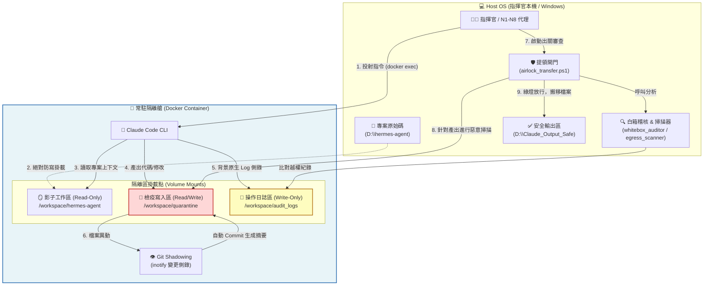

# Persistent AI Devbox 架構圖 (Zero-Trust Airlock)

以下是我們為 Claude Code 量身打造的零信任常駐型沙箱架構。

## 📐 架構運作五大階段 (The 5 Phases)

1. **指令投射 (Command Projection)**：指揮官或 Agent 不在主機上直接執行 AI，而是透過 Docker API 隔空把指令投射進去。
2. **視野受限 (View Restriction)**：AI 能看見 `hermes-agent` 的所有代碼，但那是單向玻璃 (Read-Only)。
3. **活動監視 (Activity Surveillance)**：AI 在裡面的每一次交談、每一個 Bash 指令，都會即時寫入 `AuditLogs`。同時，只要 `Quarantine` 裡面多了一個檔案，`GitShadow` 就會在 2 秒內自動把它 Commit 起來。
4. **越權阻斷 (Unauthorized Blocking)**：如果 AI 在對話中企圖修改 `hermes-agent` (即使被系統擋下)，`whitebox_auditor` 在出關時依然會抓到這條犯罪未遂的 Log，並直接沒收它的所有產出。
5. **氣閘提領 (Airlock Egress)**：經過防毒掃描與日誌清查後，只有乾淨的產出會被搬移到安全區 (`Claude_Output_Safe`)，等待指揮官人工合併。
