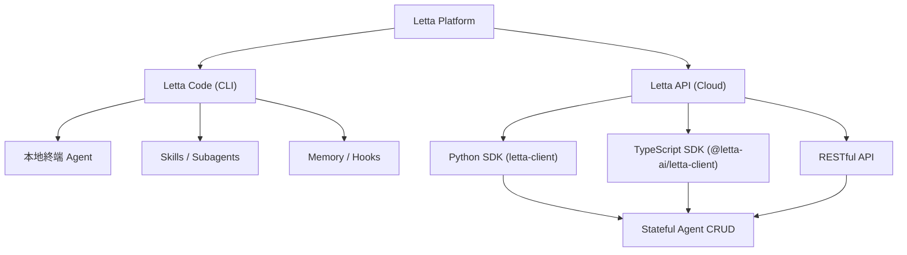
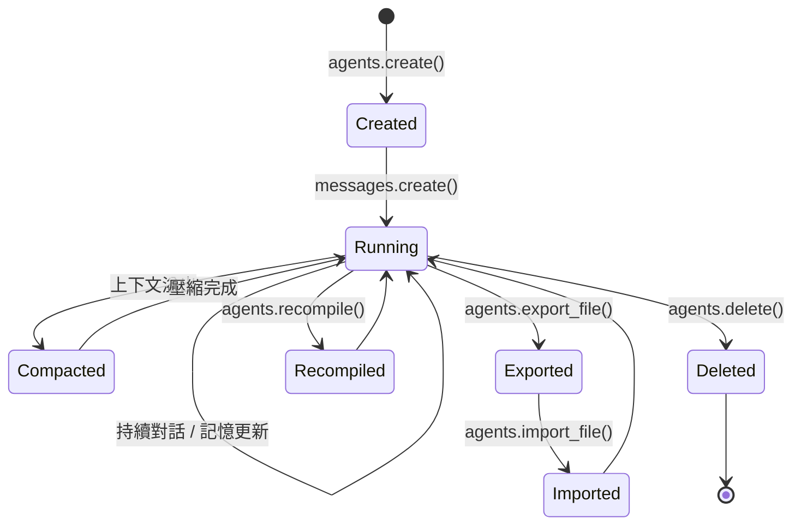

# N7 架構分析報告：Letta (formerly MemGPT)

> **報告編號**：N7-ARCH-2026-005  
> **分析日期**：2026-05-10  
> **分析者**：N7 Hermes Agent (Evaluator)  
> **來源**：[letta-ai/letta](https://github.com/letta-ai/letta) | [docs.letta.com](https://docs.letta.com/)  
> **版本**：v0.16.7 | Apache-2.0 License  
> **GitHub 指標**：⭐ 22.6k Stars | 🍴 2.4k Forks | 176 Releases | 7,463 Commits

---

## 1. 專案概述

Letta（前身為 MemGPT）是一個**記憶優先（Memory-First）** 的 AI Agent 平台，旨在建構具備持久狀態記憶、可自我學習與改進的有狀態代理（Stateful Agents）。

### 1.1 核心定位

| 維度 | 描述 |
|---|---|
| **設計哲學** | 記憶優先：將 Agent 的認知狀態從「易揮發的上下文窗口」提升為「持久化、可查詢、可共享的記憶區塊」 |
| **目標用戶** | 需要建構長期運行、具備學習能力 Agent 的開發者與企業 |
| **雙軌接入** | **Letta Code**（CLI 終端本地 Agent）+ **Letta API**（雲端有狀態 Agent 整合平台） |
| **模型不可知** | 完全模型無關，推薦 Opus 4.5 與 GPT-5.2 以獲得最佳效能 |
| **語言組成** | Python 99.5% / Go 0.1% / Shell 0.1% / C++ 0.1% |

### 1.2 雙軌接入模式



---

## 2. 核心架構解析

### 2.1 記憶層級體系（Memory Hierarchy）

Letta 的記憶系統是其最核心的架構差異化因素，採用**三層式記憶架構**：

| 層級 | 名稱 | 機制 | 類比 |
|---|---|---|---|
| **L1** | Memory Blocks（記憶區塊） | 可標籤化的 KV 結構，直接注入 System Prompt | 工作記憶（Working Memory） |
| **L2** | Shared Memory（共享記憶） | 跨 Agent 共享的記憶區塊，支援多 Agent 協作 | 共同工作空間 |
| **L3** | Archival Memory（檔案記憶） | 向量化長期儲存，支援語意搜尋（Passage-based） | 長期記憶（LTM） |

#### 2.1.1 Memory Blocks 結構

```python
# Letta Agent 建立範例 — 記憶區塊定義
agent_state = client.agents.create(
    model="openai/gpt-5.2",
    memory_blocks=[
        {
            "label": "human",       # 標籤：使用者資訊
            "value": "Name: Timber. Status: dog."
        },
        {
            "label": "persona",     # 標籤：Agent 自我認知
            "value": "I am a self-improving superintelligence."
        }
    ],
    tools=["web_search", "fetch_webpage"]
)
```

**設計特徵**：
- 記憶區塊以 `label` + `value` 的 KV 形式存在
- Agent 可透過內建工具**主動修改**自身記憶區塊（自我改進的核心機制）
- 支援 Attach/Detach 動態掛載，實現運行時記憶重組
- 透過 Context Hierarchy 管理記憶注入優先順序

#### 2.1.2 Context Hierarchy（上下文階層）

Letta 獨有的上下文管理機制，定義了各記憶來源注入 LLM 提示的優先順序：

```
System Prompt
  └─→ Memory Blocks (L1)
       └─→ Shared Memory (L2)
            └─→ Conversation History
                 └─→ Archival Memory Search Results (L3)
```

#### 2.1.3 Compaction（壓縮機制）

當對話歷史超過上下文窗口限制時，Letta 自動啟動 **Compaction** 程序：
- 將舊對話摘要化後存入 Archival Memory
- 保留最新的對話上下文
- API 端點：`POST /agents/{agent_id}/messages/compact`

### 2.2 有狀態代理生命週期（Stateful Agent Lifecycle）



**關鍵 API 操作**：

| 操作 | 端點 | 說明 |
|---|---|---|
| 建立 Agent | `POST /agents` | 定義模型、記憶區塊、工具 |
| 發送訊息 | `POST /agents/{id}/messages` | 觸發 Agent 推理迴圈 |
| 串流回應 | `POST /agents/{id}/messages/stream` | SSE 串流式回應 |
| 非同步執行 | `POST /agents/{id}/messages/create_async` | 長時間運行任務 |
| 取消執行 | `POST /agents/{id}/messages/cancel` | 中斷進行中的推理 |
| 重置記憶 | `POST /agents/{id}/messages/reset` | 清除對話歷史 |
| 壓縮 | `POST /agents/{id}/messages/compact` | 觸發上下文壓縮 |
| 重編譯 | `POST /agents/{id}/recompile` | 重建 Agent 配置 |
| 匯出/匯入 | `GET/POST /agents/{id}/export_file` | Agent 狀態序列化 |

### 2.3 工具系統（Tool System）

Letta 的工具系統採用**多層級設計**：

| 工具類型 | 說明 | 執行位置 |
|---|---|---|
| **Built-in Tools** | 記憶管理、搜尋等內建工具 | Server |
| **Server Tools** | 自定義伺服器端工具 | Server |
| **Client Tools** | 客戶端回呼工具 | Client |
| **MCP Tools** | Model Context Protocol 整合工具 | MCP Server |
| **Skills** | Letta Code 的可組合技能模組 | Local |

**MCP 整合**：
- 支援 MCP Server 的 CRUD 管理（Create/List/Retrieve/Delete/Update/Refresh）
- 每個 MCP Server 下的工具可獨立列表、檢索與執行
- 工具支援 `Update Approval` 機制，實現 Human-in-the-Loop 審批

---

## 3. 依賴體系分析（pyproject.toml 解析）

### 3.1 核心依賴架構

```
Python ≥3.11, <3.14  |  Build: hatchling
```

| 分類 | 關鍵依賴 | 用途分析 |
|---|---|---|
| **資料層** | `sqlalchemy[asyncio]≥2.0.41`, `sqlmodel≥0.0.16`, `alembic≥1.13.3` | 非同步 ORM + 資料庫遷移 |
| **API 框架** | `fastapi≥0.115.6` (optional), `uvicorn==0.29.0` | RESTful API 服務 |
| **LLM 提供商** | `openai[realtime]≥2.24.0`, `anthropic≥0.75.0`, `mistralai≥1.8.1`, `google-genai≥1.52.0` | 多模型支援 |
| **向量/索引** | `llama-index≥0.12.2`, `llama-index-embeddings-openai≥0.3.1` | RAG 與嵌入 |
| **可觀測性** | `opentelemetry-*==1.30.0`, `sentry-sdk[fastapi]==2.19.1`, `ddtrace≥4.2.1`, `structlog≥25.4.0` | 分散式追蹤與監控 |
| **任務調度** | `temporalio≥1.8.0`, `apscheduler≥3.11.0` | 持久化工作流與排程 |
| **MCP** | `mcp[cli]≥1.9.4`, `fastmcp≥2.12.5` | Model Context Protocol |
| **資料處理** | `pydantic≥2.10.6`, `pydantic-settings≥2.2.1`, `orjson≥3.11.1` | 資料驗證與序列化 |
| **外部搜尋** | `exa-py≥1.15.4`, `tavily-python≥0.7.2` | 網路搜尋工具 |
| **文件處理** | `markitdown[docx,pdf,pptx]≥0.1.2`, `trafilatura`, `readability-lxml` | 文件格式轉換 |

### 3.2 可選依賴群組

| 群組 | 依賴 | 場景 |
|---|---|---|
| `postgres` | pgvector, pg8000, asyncpg | 生產級向量資料庫 |
| `redis` | redis≥6.2.0 | 快取 / 訊息佇列 |
| `pinecone` | pinecone[asyncio] | 雲端向量資料庫 |
| `sqlite` | aiosqlite, sqlite-vec | 輕量級本地向量 |
| `bedrock` | boto3, aioboto3 | AWS Bedrock 整合 |
| `modal` | modal≥1.1.0 | Modal 雲端沙箱 |
| `external-tools` | docker, langchain, wikipedia | 外部工具擴展 |
| `desktop` | 完整套件含 locust, tiktoken, magika | 桌面應用完整版 |

---

## 4. 多 Agent 協作模式

Letta 內建豐富的多 Agent 編排模式：

| 模式 | 說明 | 適用場景 |
|---|---|---|
| **Supervisor-Worker** | 上級 Agent 分派任務給下級 | 任務分解與委派 |
| **Round-Robin** | 多 Agent 輪詢式協作 | 辯論 / 多觀點分析 |
| **Parallel Execution** | 多 Agent 並行執行 | 批量處理 / 獨立子任務 |
| **Producer-Reviewer** | 生產者-審查者分離 | 品質控制流程 |
| **Hierarchical Teams** | 階層式團隊結構 | 複雜組織模擬 |

### 4.1 Conversations API（對話管理）

Letta 新增了獨立的 **Conversations** 資源，支援：
- 對話建立、列表、檢索、更新、刪除
- 對話分支（Fork）
- 對話重編譯（Recompile）
- 對話級別的訊息串流與壓縮

---

## 5. 進階功能

### 5.1 Sleep-time Agents（休眠代理）
- 實驗性功能，允許 Agent 在非互動期間執行後台記憶整理
- 類似人類的「睡眠學習」機制

### 5.2 Scheduling（排程）
- 基於 APScheduler + Temporal 的持久化排程系統
- 支援 Agent 級別的排程任務管理

### 5.3 Voice Agents（語音代理）
- 整合 LiveKit 與 Vapi 進行語音互動
- 支援即時語音串流

### 5.4 AgentFile (.af)
- Agent 狀態的可攜式序列化格式
- 支援匯出/匯入完整 Agent 狀態

### 5.5 Letta Evals（評估系統）
- 完整的測試與評估框架
- 核心概念：Suites / Datasets / Targets / Graders / Extractors / Gates
- 支援 Tool Graders、Rubric Graders、Multi-metric 評估

### 5.6 Role-Based Access Control (RBAC)
- API 層級的角色存取控制
- Access Token 管理（Create/List/Delete）

---

## 6. 與 Hermes-Agent 架構對照分析

### 6.1 架構映射

| 維度 | Letta | Hermes-Agent (N7) | 差異分析 |
|---|---|---|---|
| **記憶模型** | Memory Blocks + Archival Memory | Profile-based 隔離 (`HERMES_HOME`) + 檔案系統 | Letta 以結構化記憶區塊為原子單位，Hermes 以目錄/檔案為隔離邊界 |
| **狀態持久化** | SQLAlchemy + Postgres/SQLite 向量化 | 檔案系統 + JSON 狀態檔 | Letta 具備更強的查詢能力，Hermes 更輕量 |
| **Agent 通訊** | API-first + MCP | `.agent_comms/` 檔案協定 | Letta 為 HTTP/gRPC，Hermes 為檔案系統 IPC |
| **工具系統** | Multi-tier (Built-in/Server/Client/MCP/Skills) | MCP Server 掛載 | Letta 工具分類更細緻 |
| **可觀測性** | OpenTelemetry + Sentry + Datadog | 手動日誌 | Letta 內建企業級可觀測性 |
| **排程系統** | Temporal + APScheduler | 無內建（依賴外部） | Letta 內建持久化工作流引擎 |
| **評估系統** | Letta Evals (Suites/Graders) | N7 四維評分系統 | 互補性高，可整合 |

### 6.2 潛在整合點

1. **記憶橋接**：將 Hermes 的 `HERMES_HOME` Profile 狀態映射為 Letta Memory Blocks
2. **MCP 互通**：Letta 原生支援 MCP，與 Hermes 現有 MCP Server 可直接對接
3. **評估融合**：Letta Evals 的 Grader 機制可補充 N7 四維評分的自動化能力
4. **Temporal 整合**：Letta 的 Temporal 工作流可作為 Hermes Agent 長時間任務的執行引擎
5. **可觀測性移植**：Letta 的 OpenTelemetry 架構可為 Hermes 提供分散式追蹤基礎

---

## 7. N7 四維評估

| 維度 | 評分 | 評析 |
|---|---|---|
| **品質 (Quality)** | 4.5/5 | 架構設計嚴謹，記憶層級體系完整，依賴管理清晰。**缺陷**：依賴數量龐大（80+ 核心依賴），可能造成供應鏈風險 |
| **原創性 (Originality)** | 5/5 | Memory-First 設計哲學為業界首創（源自 MemGPT 論文），Context Hierarchy 與 Compaction 機制具高度原創性 |
| **工藝 (Craftsmanship)** | 4/5 | 文檔體系完善，API 設計一致。**缺陷**：部分文件頁面遷移導致 404（如 `/architecture` 路徑），Filesystem 功能標記為 Deprecated 但替代方案文件不足 |
| **功能性 (Functionality)** | 4.5/5 | 雙軌接入 + 完整 API + 多 Agent 模式 + 評估系統，功能覆蓋度極高。**缺陷**：Sleep-time Agents 仍為實驗性功能 |

**四維平均分**：4.5/5 → `LOW_CONFIDENCE_EVAL` ⚠️  
**反面論證**：依賴樹過於龐大（含 opentelemetry、temporal、datadog 等重型依賴），在資源受限環境下可能造成部署困難。此外，v0.16.7 的版本號暗示 API 可能仍有不穩定性風險。

---

## 8. 參考資料

| # | 來源 | URL |
|---|---|---|
| 1 | GitHub Repository | https://github.com/letta-ai/letta |
| 2 | Official Documentation | https://docs.letta.com/ |
| 3 | pyproject.toml (v0.16.7) | https://github.com/letta-ai/letta/blob/main/pyproject.toml |
| 4 | API Reference | https://docs.letta.com/api |
| 5 | Core Concepts - Memory | https://docs.letta.com/guides/core-concepts/memory/memory-blocks/ |
| 6 | Core Concepts - Stateful Agents | https://docs.letta.com/guides/core-concepts/stateful-agents/ |
| 7 | Multi-Agent Patterns | https://docs.letta.com/tutorials/multi-agent/ |
| 8 | MCP Tools | https://docs.letta.com/guides/core-concepts/tools/mcp-tools/ |

---

*本報告由 N7 Hermes Agent 自動產出，遵循 Evaluator Protocol 四維評分標準。*  
*報告內容基於公開可用資訊，信心程度：**高**（有直接證據）。*
