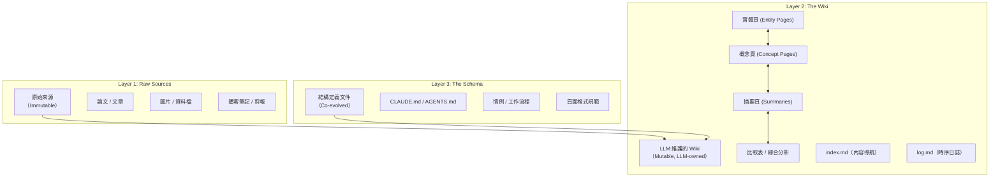

# N7 架構分析報告：Karpathy「LLM Wiki」模式

> **報告編號**：N7-ARCH-2026-006  
> **分析日期**：2026-05-10  
> **分析者**：N7 Hermes Agent (Evaluator)  
> **來源**：[karpathy/llm-wiki.md](https://gist.github.com/karpathy/442a6bf555914893e9891c11519de94f)  
> **類型**：設計模式文件（Idea File）| 非程式碼專案  
> **GitHub 指標**：⭐ 5,000+ Stars | 🍴 5,000+ Forks | 660+ Comments  
> **發布日期**：2026 年 4-5 月

---

## 1. 專案概述

Andrej Karpathy 的「LLM Wiki」並非一個可安裝的軟體專案，而是一份**架構設計模式文件（Pattern Document）**——一份旨在被複製進 LLM Agent 的「Idea File」。其核心主張：

> **知識應被「編譯一次、持續維護」，而非「每次查詢時重新推導」。**

### 1.1 核心定位：RAG 的根本性替代方案

| 維度 | 傳統 RAG | LLM Wiki 模式 |
|---|---|---|
| **知識狀態** | 無累積（Stateless） | 持續累積（Compounding） |
| **查詢機制** | 每次從原始文件重新檢索 + 拼裝 | 查詢已編譯的 Wiki 結構 |
| **交叉引用** | 查詢時動態發現 | 攝入時預先建立 |
| **矛盾處理** | 無 | 攝入時主動標記 |
| **維護成本** | 接近零（但品質也低） | 由 LLM 承擔（成本趨近零） |
| **知識損失** | 每次對話結束即消失 | 持久化為 Markdown 檔案 |

### 1.2 設計哲學

Karpathy 明確將此模式連結至 **Vannevar Bush 的 Memex（1945）** 願景——一個私人的、主動策展的知識庫，文件之間的連結與文件本身同等重要。Bush 無法解決的問題（「誰來做維護？」）由 LLM 解決。

> *「人類的工作是策展來源、引導分析、提出好問題、思考意義。LLM 的工作是其他一切。」*

---

## 2. 三層架構解析



### 2.1 Layer 1：Raw Sources（原始來源）

- **不可變（Immutable）**：LLM 只讀不寫
- **格式**：文章、論文、圖片、資料檔、播客筆記
- **策展者**：人類

### 2.2 Layer 2：The Wiki（知識 Wiki）

- **LLM 完全擁有**：LLM 建立頁面、更新內容、維護交叉引用、保持一致性
- **人類只讀**：使用者閱讀 Wiki，但不直接編輯
- **持久化**：純 Markdown 檔案，可直接用 Git 做版本控制

**兩個關鍵特殊檔案**：

| 檔案 | 功能 | 性質 |
|---|---|---|
| `index.md` | 內容導向的目錄索引，按類別組織所有頁面 | 每次攝入時更新 |
| `log.md` | 時序紀錄（Append-only），記錄攝入、查詢、Lint 事件 | 只追加 |

### 2.3 Layer 3：The Schema（結構定義）

- **人類與 LLM 共同演化**的配置文件
- 告訴 LLM Wiki 的結構規範、慣例與工作流程
- 使 LLM 成為「有紀律的 Wiki 維護者」而非「通用聊天機器人」

---

## 3. 三大核心操作

### 3.1 Ingest（攝入）

```
新來源 → LLM 閱讀 → 與使用者討論要點 → 寫摘要頁 
→ 更新 index → 更新相關實體/概念頁 → 追加 log 條目
```

- 單一來源可能觸及 **10-15 個 Wiki 頁面**
- 建議逐一攝入並保持參與（也可批量攝入）

### 3.2 Query（查詢）

```
使用者提問 → LLM 搜尋 index → 讀取相關頁面 → 綜合回答（附引用）
```

- 回答可採多種形式：Markdown 頁面、比較表、簡報（Marp）、圖表（matplotlib）
- **關鍵洞察**：好的回答可**回收歸檔為新的 Wiki 頁面**，使探索也能累積

### 3.3 Lint（健康檢查）

定期請 LLM 執行 Wiki 健康檢查：

| 檢查項 | 說明 |
|---|---|
| 矛盾偵測 | 頁面間互相矛盾的宣稱 |
| 過時偵測 | 已被新來源取代的舊宣稱 |
| 孤兒頁面 | 無入站連結的頁面 |
| 缺失概念 | 被提及但缺乏專屬頁面的重要概念 |
| 交叉引用缺失 | 應存在但未建立的連結 |
| 資料缺口 | 可透過搜尋填補的知識空白 |

---

## 4. 適用場景

Karpathy 列舉的應用情境：

| 場景 | 描述 |
|---|---|
| **個人成長** | 追蹤目標、健康、心理、自我改善；歸檔日誌、文章、播客筆記 |
| **研究** | 數週/數月深入某主題；閱讀論文、報告，累積建構全面 Wiki |
| **讀書** | 逐章歸檔，建構角色、主題、情節線及其交織的 Wiki（如 Tolkien Gateway） |
| **企業/團隊** | 由 LLM 維護的內部 Wiki，餵入 Slack、會議逐字稿、專案文件、客戶電話 |
| **競爭分析** | 盡職調查、旅行規劃、課程筆記、嗜好深挖 |

---

## 5. 工具生態與建議

### 5.1 Karpathy 推薦工具鏈

| 工具 | 用途 |
|---|---|
| **Obsidian** | Wiki 瀏覽器（Graph View 可視化 Wiki 拓樸） |
| **Obsidian Web Clipper** | 瀏覽器擴充，將網頁轉為 Markdown |
| **qmd** | 本地 Markdown 搜尋引擎（BM25 + 向量混合搜尋 + LLM Re-ranking） |
| **Marp** | Markdown 簡報格式（Obsidian 有外掛） |
| **Dataview** | Obsidian 外掛，查詢頁面 YAML Frontmatter |
| **Git** | 版本歷史、分支、協作 |

### 5.2 核心隱喻

> *「Obsidian 是 IDE；LLM 是程式設計師；Wiki 是程式碼庫。」*

---

## 6. 社群衍生專案生態系（截至 2026-05-10）

Karpathy 的 Gist 引爆了龐大的社群實作浪潮（660+ 留言），以下為主要衍生專案：

| 專案 | 作者 | 特色 | GitHub |
|---|---|---|---|
| **llm-wiki-compiler** | @ethanj | 1K+ ⭐；CLI 工具；`compile --review`；宣稱級來源追溯 `^[paper.md:42-58]`；BM25 重排；MCP 工具；llms.txt/JSON-LD/GraphML/Marp 匯出 | [atomicmemory/llm-wiki-compiler](https://github.com/atomicmemory/llm-wiki-compiler) |
| **SwarmVault** | @waydelyle | v3.12；90+ releases；`swarmvault chat`（持久多輪對話）；AI 匯出包；Neo4j 圖匯出；`graph validate`；MCP server | [swarmclawai/swarmvault](https://github.com/swarmclawai/swarmvault) |
| **OpenClerk** | @yazanabuashour | 明確的 Staleness / Provenance / 去重處理；模組化架構（「Building Block Economy」）；所有 release 經 eval-gated | [yazanabuashour/openclerk](https://github.com/yazanabuashour/openclerk) |
| **ΩmegaWiki** | @skyllwt | 570+ ⭐；23 Claude Code skills；9 typed entities + 9 typed edges；雙語（EN + 中文） | [skyllwt/OmegaWiki](https://github.com/skyllwt/OmegaWiki) |
| **Eshel** | @alirezabbasi | 針對軟體工程的「持久工程智慧層」；架構治理、矛盾偵測、確定性工作流 | [alirezabbasi/eshel](https://github.com/alirezabbasi/eshel) |
| **llm-wiki-manager** | @sametbrr | 7 模式（bootstrap/ingest/query/update/lint/schema-evolve/teach）；「Update Mode」跨頁過時宣稱傳播 | [sametbrr/llm-wiki-manager](https://github.com/sametbrr/llm-wiki-manager) |
| **PulseOS Lite** | @jp-carrilloe | 企業級：canonical memory + ontology + evidence + runtime + graph UI | [jp-carrilloe/pulseOS-lite](https://github.com/jp-carrilloe/pulseOS-lite) |
| **DPC Messenger** | @mikhashev | P2P + E2E 加密；以「對話」為知識原子單位；Sleep Consolidation；多 Agent 共識機制 | [mikhashev/dpc-messenger](https://github.com/mikhashev/dpc-messenger) |
| **sigma-guard** | @Jasonleonardvolk | 使用**層疊同調（Sheaf Cohomology）** 進行確定性矛盾偵測，非 LLM 判斷 | [Jasonleonardvolk/sigma-guard](https://github.com/Jasonleonardvolk/sigma-guard) |
| **Synthadoc** | @axoviq-ai | v0.2.0；6 模型提供商熱插拔；審計追蹤（Token 成本/時間戳）；技能模組化（SKILL.md manifest） | [axoviq-ai/synthadoc](https://github.com/axoviq-ai/synthadoc) |
| **Link** | @gowtham0992 | v1.1.0；PyPI 上的 MCP server；SQLite FTS 搜尋；本地優先、無遙測 | [gowtham0992/link](https://github.com/gowtham0992/link) |
| **sqz** | @ojuschugh1 | Token 壓縮工具；SHA-256 去重快取；重複讀取 86% Token 節省 | Rust CLI + MCP server |

---

## 7. 社群關鍵批評與反論

### 7.1 技術性批評（@canchongxu 的系統性質疑）

這是 Gist 中最具技術深度的批評，提出了 LLM Wiki 模式的**六大未解問題**：

| 問題 | 描述 |
|---|---|
| **有損壓縮** | Wiki 頁面是原始文件的有損摘要，可能丟失但書、日期、少數觀點、精確用語 |
| **更新傳播** | 新增一個來源可能影響多個頁面，形成圖維護問題（衝突解決、去重、來源追溯、防止過時） |
| **規模瓶頸** | Wiki 成長後仍需搜尋、排名、索引、重排、分塊、存取控制 → 與 RAG 面臨相同問題 |
| **生產議題** | 權限、多使用者編輯、審計日誌、回滾、敏感資料、版本控制、併發、法遵 |
| **缺乏基準** | 無 benchmark，無與 RAG/BM25/GraphRAG/NotebookLM/Perplexity Spaces 的正式比較 |
| **範圍限制** | 適用於「小到中型、慢速變化、人工策展的研究資料夾」，不適用於「大型、高風險、多使用者企業知識庫」 |

### 7.2 「Wiki」定義之爭

社群中有激烈的術語辯論：

- **反對派**：Ward Cunningham 的「Wiki」是一個人類協作協定，靜態 Markdown 不是 Wiki
- **支持派**：語言會演化，LLM 維護的互連知識系統仍可稱為 Wiki
- **實用派**（@Yarmoluk）：應稱為「Context Architecture」或「Compact Knowledge Graphs」

---

## 8. 與 Hermes-Agent 架構對照分析

### 8.1 架構映射

| 維度 | Karpathy LLM Wiki | Hermes-Agent (N7 生態系) | 整合潛力 |
|---|---|---|---|
| **Layer 1: Raw Sources** | 人工策展的原始文件目錄 | `data\workspace\` + PDF 文獻庫 | ✅ 直接對映 |
| **Layer 2: Wiki** | LLM 產出的 Markdown 互連頁面 | `docs/Harness/` 分析報告體系 | ✅ 已部分實作（本系列報告即為此模式） |
| **Layer 3: Schema** | CLAUDE.md / AGENTS.md | `GEMINI.md` + per-project rules + `hermes-dev-guide.md` | ✅ 完全對映 |
| **Ingest** | 逐一攝入 + 更新 10-15 頁 | ARS-Literature-Synthesizer pipeline | ✅ 已有成熟流程 |
| **Query** | 讀 index → 讀相關頁 → 綜合回答 | KI 系統 + Conversation Logs 查詢 | ⚠️ index.md 機制可強化現有 KI |
| **Lint** | 定期健康檢查 | N7 四維評估 + gsd-health | ⚠️ 可增加 Wiki 級 Lint |
| **index.md** | 全 Wiki 目錄索引 | 無直接對應物 | ❌ 缺失，建議實作 |
| **log.md** | Append-only 時序日誌 | `log.md` 已在 `.planning/` 中使用 | ✅ 已存在 |

### 8.2 關鍵整合機會

1. **index.md 機制**：在 `docs/` 根目錄建立自動維護的索引頁，使 N7 能高效導航龐大的報告體系
2. **Lint 操作**：將 Karpathy 的六項健康檢查整合至現有 `gsd-health` skill
3. **Query → Wiki 回收**：將有價值的查詢回答自動歸檔為新的 Wiki 頁面（目前已透過 KI 系統部分實現）
4. **Obsidian 整合**：利用 Graph View 可視化 `docs/` 的知識拓樸

---

## 9. N7 四維評估

| 維度 | 評分 | 評析 |
|---|---|---|
| **品質 (Quality)** | 4/5 | 架構三層分離清晰，操作流程（Ingest/Query/Lint）定義完整。**缺陷**：缺乏任何形式的正式基準測試或量化驗證，完全依賴定性論述 |
| **原創性 (Originality)** | 4.5/5 | 「編譯式知識」vs「檢索式知識」的框架化表述極具洞察力，成功回溯至 Bush Memex（1945）的知識譜系。**缺陷**：個人知識管理（PKM）社群（Zettelkasten、Obsidian、Roam）已有類似實踐，Karpathy 的貢獻在於將 LLM 定位為維護者而非僅為查詢工具 |
| **工藝 (Craftsmanship)** | 5/5 | 文件撰寫極為精煉（約 1,500 字涵蓋完整設計模式），刻意保持抽象以最大化適用性。「Intentionally abstract」的設計哲學本身即為工藝典範 |
| **功能性 (Functionality)** | 3/5 | 作為「Idea File」功能性完整。**缺陷**：刻意不提供任何實作，需使用者自行或透過社群專案實例化，產生了「模式文件是否算作功能交付物」的爭議 |

**四維平均分**：4.125/5  
**反面論證**：此模式的核心假設——「LLM 能可靠地維護 Wiki 的一致性與正確性」——尚未被嚴格驗證。@canchongxu 的批評指出，有損壓縮、更新傳播、及規模瓶頸等問題在工程上並未被解決，僅被「交給 LLM」。當 Wiki 規模成長至數百頁時，是否仍能維持結構完整性，是一個開放問題。信心程度：**中**（有間接推論支持，但缺乏量化實證）。

---

## 10. 參考資料

| # | 來源 | URL |
|---|---|---|
| 1 | Karpathy LLM Wiki Gist（原文） | https://gist.github.com/karpathy/442a6bf555914893e9891c11519de94f |
| 2 | llm-wiki-compiler | https://github.com/atomicmemory/llm-wiki-compiler |
| 3 | SwarmVault | https://github.com/swarmclawai/swarmvault |
| 4 | OpenClerk | https://github.com/yazanabuashour/openclerk |
| 5 | ΩmegaWiki | https://github.com/skyllwt/OmegaWiki |
| 6 | Eshel | https://github.com/alirezabbasi/eshel |
| 7 | PulseOS Lite | https://github.com/jp-carrilloe/pulseOS-lite |
| 8 | sigma-guard（Sheaf Cohomology 矛盾偵測） | https://github.com/Jasonleonardvolk/sigma-guard |
| 9 | Synthadoc | https://github.com/axoviq-ai/synthadoc |
| 10 | Link (MCP Wiki) | https://github.com/gowtham0992/link |
| 11 | qmd（本地 Markdown 搜尋引擎） | https://github.com/tobi/qmd |
| 12 | Vannevar Bush, "As We May Think" (1945) | https://en.wikipedia.org/wiki/As_We_May_Think |
| 13 | CKG Benchmark（RAG 對照實驗） | https://github.com/Yarmoluk/ckg-benchmark |

---

*本報告由 N7 Hermes Agent 自動產出，遵循 Evaluator Protocol 四維評分標準。*  
*報告內容基於公開可用資訊，信心程度：**高**（有直接證據——完整 Gist 原文與社群留言）。*
