# N8 架構升級計畫：在地化 Deep Research Agent 實作

## 1. 核心願景 (Goal Description)

指揮官原先的構想是將 N8 打造為「N5 的強化版」，專注於學術品質與倫理。然而，根據 Google 最新發布的 **Gemini Deep Research (及 Max 版本)**，下一代的 AI 研究不再是單次的一問一答，而是具備「多步驟自主探勘」、「動態協同規劃 (Collaborative Planning)」與「視覺化分析 (Visualization)」能力的長期執行代理人 (Long-running Agent)。

為避免使用官方 Interactions API 所帶來的高昂 Token 費用，本計畫將運用我們既有的 **GStack 框架、12-agent 學術管線與 N2 (全域法務研究中心)**，透過架構設計在本地端「完美復刻」Deep Research 的核心機制，讓 N8 成為無可匹敵的 **學術先知 (Academic Oracle Agent)**。
*(註：N2 預計將整合 Consensus MCP 與 8 大專業法務資料庫。由於 N2 尚未上線，目前的實作將暫以 Consensus MCP 作為 N8 的臨時資料引擎，待 N2 完工後無縫切換。)*

---

## 2. Deep Research 核心機制之「本地化映射」

我們將透過 N8 的 `persona.md` 與專屬 Python 工作流，映射出 Google Deep Research 的四大核心特色：

| Deep Research 官方功能 | N8 本地端替代實作 (Local Emulation) | 達成效果 |
| :--- | :--- | :--- |
| **Collaborative Planning (協同規劃)** | 攔截器機制：N8 接獲任務後，**強制暫停寫作**，優先產出 `Research_Plan.md` 交由 N1/指揮官核准。 | 使用者能介入控制研究方向，避免方向錯誤的無效計算。 |
| **Test-Time Compute (多輪深度推論)** | 實作 `Deep_Research_Loop`：呼叫 **N2 (暫以 Consensus MCP 替代)** 進行「檢索 ➔ 發現盲點 ➔ 修正 Query ➔ 再次檢索」的 5 輪迴圈。 | 突破單次 Prompt 限制，產生高密度的文獻綜整。 |
| **Multimodal Visualization (視覺化)** | 結合 `run_command` 與 Python (Matplotlib/Seaborn)，由 N8 自行撰寫腳本生成數據圖表 (`.png`) 並嵌入報告中。 | 將死板的論文數據轉化為動態圖表，大幅提升說服力。 |
| **Background Tasks (背景長駐執行)** | 搭配 N6 (Mem_Agent) 與背景 Event Sourcing，N8 在執行多輪迴圈時不卡死前端，完成後主動發送通知。 | 實現長脈絡、數十分鐘等級的高難度學術研究。 |

*(註：目前 N2 與 N6 尚未上線，待上線後將會把完整管線補齊至 N8 的背景工作流中。)*

---

## 3. N8 運作架構圖 (N8 Deep Research Workflow)

```mermaid
sequenceDiagram
    participant User as 指揮官 (N1)
    participant N8 as N8 (Academic_Oracle_Agent)
    participant N2 as N2 (Legal_Research_Agent)<br/>※暫以 Consensus MCP 替代
    participant Code as 本機環境 (Python)
    
    User->>N8: [Request] 研究特定學術議題 (e.g. TPU 發展史)
    
    %% Phase 1: Collaborative Planning
    rect rgb(20, 40, 60)
        Note over N8: Phase 1: Collaborative Planning
        N8-->>User: 產出 Research_Plan.md (含搜尋策略與假說)
        User->>N8: [Approve/Refine] 修正方向並核准
    end
    
    %% Phase 2: Autonomous Deep Research Loop
    rect rgb(60, 20, 20)
        Note over N8,N2: Phase 2: Autonomous Deep Loop (Test-Time Compute)
        loop Max 5 Iterations
            N8->>N2: 發動高階 Query 檢索請求
            N2-->>N8: 回傳實證論文與法理數據
            N8->>N8: 分析知識斷層與矛盾，生成下一個 Query
        end
    end
    
    %% Phase 3: Visualization & Drafting
    rect rgb(20, 60, 20)
        Note over N8,Code: Phase 3: Visualization & Synthesis
        N8->>Code: 撰寫 Python 腳本繪製統計圖表 (Visualization)
        Code-->>N8: 生成 output_chart.png
        N8->>N8: 本身調用 12-agent 學術管線進行 SSCI 規格起草
    end
    
    N8-->>User: 提交最終附帶圖表與 100% 準確 Citation 的深度報告
```



---

## 4. N8 實體資料夾架構 (GStack/GSD Directory Architecture)

為了確保 N8 的運作完全符合 GStack (邏輯與工具分離) 與 GSD (動態狀態與專案隔離) 的最高準則，避免後續架構混亂或需要頻繁重構，N8 的實體防區將嚴格定義如下：

```text
D:\Agent_Hub\agents\Academic_Oracle_Agent\
├── persona.md                  # N8 核心靈魂 (強制 Collaborative Planning 與 5-Loop 邏輯)
├── config.yaml                 # 註冊資訊、依賴庫 (Matplotlib, Pandas) 與 N2/Consensus MCP 綁定
├── .agentignore                # 零信任隔離設定，嚴防污染其他防區
│
├── scripts/                    # 引擎控制區 (GStack 邏輯層)
│   ├── collaborative_interceptor.py # Phase 1 攔截器，未獲核准前鎖死後續管線
│   ├── deep_research_loop.py   # Phase 2 核心：5輪迴圈控制 (發送 Query -> 分析 Gap -> 更新 Query)
│   ├── visual_generator.py     # Phase 3 視覺化生成器：讀取數據並執行動態 Python 繪圖
│   └── pipeline_trigger.py     # Phase 4 起草觸發器：將彙整好的資料打包送交 `12-agent` 學術管線
│
├── skills/                     # 技能掛載區
│   └── academic-paper/         # (Symlink) 指向本地 12-agent 學術管線
│
├── data/                       # 核心工作區 (GSD 資料層)
│   ├── templates/              # 範本庫 (Research_Plan 範本、特定圖表 Matplotlib 範本)
│   └── workspace/              # 動態專案執行區 (以 UUID 或 Project_Name 隔離)
│       └── [project_id]/
│           ├── 01_planning/    # 存放 research_plan.md, hypotheses.md
│           ├── 02_raw_data/    # 存放每輪 N2 (暫以 Consensus 代替) 爬回來的論文摘要、交叉分析 JSON
│           ├── 03_visuals/     # 存放 N8 寫出的繪圖腳本與最終產出的 .png / .svg
│           └── 04_drafts/      # 存放 12-agent 管線產出的 SSCI 初稿與 LaTeX 源碼
│
└── memory/                     # 記憶體與日誌區 (銜接 N6 Mem_Agent)
    ├── auto_memory/            # 存放除錯或執行經驗 (Issue 總結)
    └── event_sourcing/         # 記錄 Deep Loop 的每一次推論與 API 調用 (供 RCA 溯源)
```

---

## 5. 擬定變更 (Proposed Changes)

為了實踐上述架構，接下來我們需要在 `D:\Agent_Hub\agents\Academic_Oracle_Agent` 建立以下基建：

### N8 沙箱防區建立 (New Files)
#### [NEW] `D:\Agent_Hub\agents\Academic_Oracle_Agent\persona.md`
> [!IMPORTANT]
> 寫入 N8 的靈魂，強制其以「Deep Research Max」的邏輯運作：
> 1. 強制執行 `Collaborative Planning` (未經核准不准起草)。
> 2. 定義 `Deep_Research_Loop` 迴圈規則，突破 API 上限。
> 3. 賦予利用程式碼生成圖表的視覺化權限。

#### [NEW] `D:\Agent_Hub\agents\Academic_Oracle_Agent\config.yaml`
> 註冊 N8 的身分識別與參數設定。

#### [NEW] `D:\Agent_Hub\agents\Academic_Oracle_Agent\scripts\deep_research_loop.py`
> [!TIP]
> 此腳本將封裝對 **N2 (短期內暫呼叫 Consensus MCP)** 的迴圈呼叫邏輯，讓 N8 只要呼叫此腳本，就能自動執行「檢索 ➔ 萃取 ➔ 交叉比對」的 5 輪深度探勘 (Deep Loop = 5)。

---

## 6. User Review Required (需指揮官確認)

> [!NOTE]
> **指揮官決議 (Commander's Directives)：**
> 1. **Visualizations 權限**：確認開啟，目前先開給 N8 執行圖表生成。
> 2. **Deep Loop 深度設定**：已調高至 **5 次** 深度下鑽 (Iterations)，以達到 Max 級別的研究深度。

*(依據指揮官指示：上述架構改定後先按兵不動，等待進一步指令始可開工。)*
