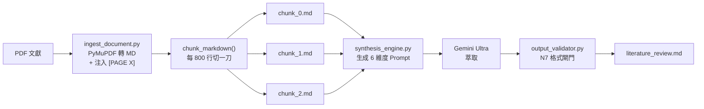
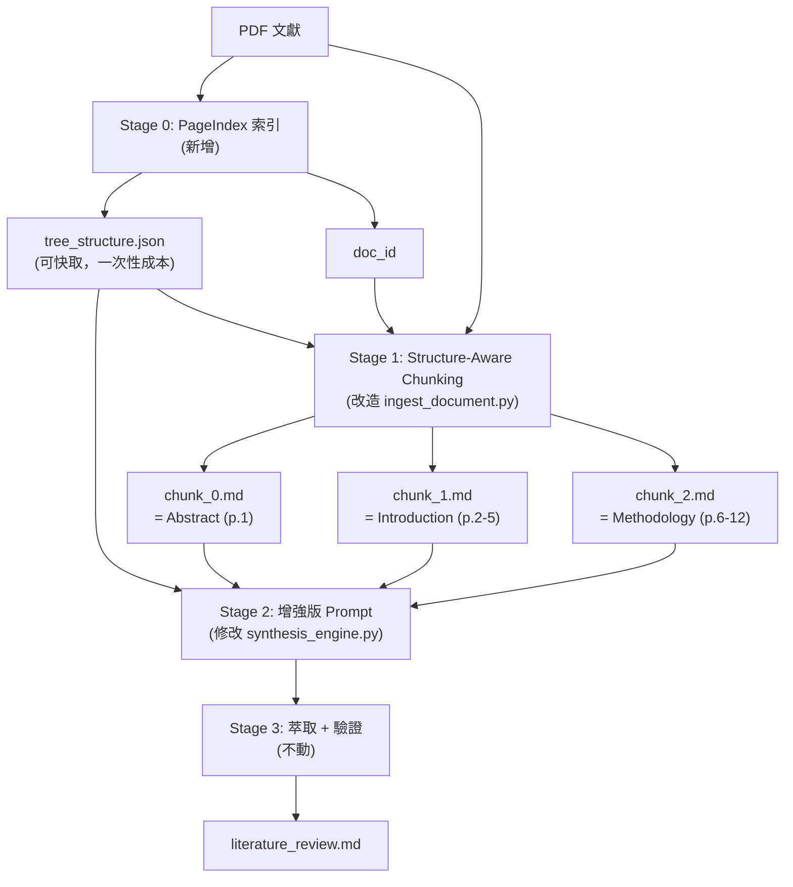

# PageIndex × ARS Literature Synthesizer 整合研究報告

## 問題診斷：為什麼現有文獻整理的品質會受限？

### 現有 ARS 管線的資料流



### 現有管線的 6 個腳本

| 腳本 | 職責 | 本次是否修改 |
|---|---|---|
| [ingest_document.py](file:///D:/Agent_Hub/skills/ars-literature-synthesizer/scripts/ingest_document.py) | PDF→MD 轉換 + 固定行數切塊 | ✅ 需修改 |
| [synthesis_engine.py](file:///D:/Agent_Hub/skills/ars-literature-synthesizer/scripts/synthesis_engine.py) | 組裝 6 維度萃取 Prompt | ✅ 需修改 |
| [output_validator.py](file:///D:/Agent_Hub/skills/ars-literature-synthesizer/scripts/output_validator.py) | N7 Regex 格式驗證 | ❌ 不動 |
| [wave_orchestrator.py](file:///D:/Agent_Hub/skills/ars-literature-synthesizer/scripts/wave_orchestrator.py) | 並行 chunk 執行 | ❌ 不動 |
| [gsd_wave_generator.py](file:///D:/Agent_Hub/skills/ars-literature-synthesizer/scripts/gsd_wave_generator.py) | GSD Plan 生成 | ❌ 不動 |
| [llm_caller.py](file:///D:/Agent_Hub/skills/ars-literature-synthesizer/scripts/llm_caller.py) | LLM API 調用（已手動化） | ❌ 不動 |

### 🔴 核心痛點：固定行數切塊的語義斷裂

現有 `chunk_markdown()` 的邏輯（[ingest_document.py:91-148](file:///D:/Agent_Hub/skills/ars-literature-synthesizer/scripts/ingest_document.py#L91-L148)）：

```python
def chunk_markdown(md_filepath, chunk_lines=800):
    # 每 800 行切一刀
    if line_count_in_chunk >= chunk_lines:
        # 切割！不管語義是否完整
        ...
        # 只繼承頁碼標籤，不繼承語義上下文
        if last_page_tag:
            f_out.write(f"{last_page_tag} <!-- inherited -->\n")
```

**問題**：
1. **論證被截斷**：一個完整論點可能橫跨第 795-805 行，被切成兩個 chunk，LLM 兩邊都看不到完整邏輯
2. **章節混雜**：一個 chunk 可能包含前一章的結尾 + 後一章的開頭，語義混亂
3. **無全局視野**：每個 chunk 的 LLM 是「盲人摸象」——只看到 800 行片段，不知道全文在講什麼
4. **page-context carry-forward 只解決頁碼**：`<!-- inherited -->` 只讓 LLM 知道「現在在第幾頁」，但不知道「現在在哪個章節、前面討論了什麼」

---

## PageIndex 如何解決這些問題

### PageIndex 的核心產出

PageIndex 用 LLM 將 PDF 理解為一棵**語義樹**：

```json
{
  "doc_name": "governance_paper.pdf",
  "doc_description": "A study on corporate compliance governance...",
  "structure": [
    {
      "title": "Abstract",
      "page_start": 1, "page_end": 1,
      "summary": "This paper examines...",
      "node_id": "1",
      "nodes": []
    },
    {
      "title": "1. Introduction",
      "page_start": 2, "page_end": 5,
      "summary": "The authors argue that...",
      "node_id": "2",
      "nodes": [
        {
          "title": "1.1 Research Background",
          "page_start": 2, "page_end": 3,
          "summary": "...",
          "node_id": "2.1"
        },
        {
          "title": "1.2 Research Questions",
          "page_start": 4, "page_end": 5,
          "summary": "...",
          "node_id": "2.2"
        }
      ]
    }
  ]
}
```

### 關鍵差異

| 維度 | 現有固定切塊 | PageIndex 結構感知切塊 |
|---|---|---|
| 切割邊界 | 第 800 行 | 章節/小節邊界 |
| 語義完整性 | ❌ 論證可能被截斷 | ✅ 每個 chunk = 完整章節 |
| 全局地圖 | ❌ 每個 chunk 是孤島 | ✅ 每個 chunk 攜帶完整文件結構 |
| 上下文標注 | 僅頁碼 | 章節位置 + 前後章節摘要 |
| 頁碼追蹤 | `[PAGE X]` 標籤 | `page_start`/`page_end` 欄位 |

---

## Proposed Changes

### 整合後的流程（4 階段）



---

### [NEW] `scripts/pageindex_adapter.py` — PageIndex 適配層

核心新增腳本，負責：
1. 呼叫 `PageIndexClient` 建構樹索引
2. 按語義章節邊界切割 chunk
3. 為每個 chunk 注入 `[PAGE X]` 標籤（保持與 `output_validator.py` 的相容性）
4. 為每個 chunk 生成上下文元資料

```python
# 精確的 API 設計（偽代碼）

from pageindex import PageIndexClient

def index_and_chunk(pdf_path, workspace, model="gpt-4o", max_tokens=20000):
    """
    用 PageIndex 建構語義索引，然後按章節邊界切割。
    
    Returns:
        chunks: List[dict] — 每個 chunk 包含:
            - context: 在全文中的位置描述
            - summary: 該章節的 PageIndex 摘要
            - pages: 頁碼範圍字串
            - content: 帶 [PAGE X] 標籤的文本
            - tree_map: 全文結構骨架（去除 text，省 token）
    """
    # 1. 建構索引（可快取）
    client = PageIndexClient(workspace=workspace, model=model)
    doc_id = client.index(pdf_path)
    
    # 2. 取得結構骨架
    tree_structure = json.loads(client.get_document_structure(doc_id))
    
    # 3. 按章節遍歷，生成語義完整的 chunk
    chunks = []
    for section in tree_structure:
        page_range = f"{section['page_start']}-{section['page_end']}"
        content_data = json.loads(client.get_page_content(doc_id, page_range))
        
        # 注入 [PAGE X] 標籤（保持與現有管線相容）
        section_text = ""
        for page in content_data:
            section_text += f"\n\n[PAGE {page['page']}]\n\n"
            section_text += page['content']
        
        chunks.append({
            'context': f"本段落位於全文結構的：{section['title']}",
            'summary': section.get('summary', ''),
            'pages': page_range,
            'content': section_text,
            'tree_map': tree_structure  # 全文骨架
        })
    
    return chunks, doc_id
```

---

### [MODIFY] [synthesis_engine.py](file:///D:/Agent_Hub/skills/ars-literature-synthesizer/scripts/synthesis_engine.py) — 增強 Prompt

在 `build_synthesis_prompt()` 中新增**區塊零**：

```diff
 def build_synthesis_prompt(chunk_content, thesis="", document_title="",
+                           structure_map=None, chunk_context=None):
     """
     建構 6 維度 ARS 文獻萃取 Prompt。
     
     架構（由上而下的區塊）：
+    0. 文件結構導航地圖 — PageIndex 生成的全文骨架 (新增)
     1. PRE-FLIGHT CHECK — 前置偵測 [PAGE X] 標籤
     2. 底層解析規則 — 頁碼就近向前 + 法遵替換 + Glossary
     3. 6 維度嚴格定義 — 環環相扣依賴鍊
     4. 強制輸出模板 — 鎖死 Markdown 結構
     """
+    # 區塊零：文件結構導航地圖（僅在 PageIndex 模式下注入）
+    structure_section = ""
+    if structure_map and chunk_context:
+        # 只注入前 2 層深度的結構，控制 token 消耗
+        slim_map = truncate_tree_depth(structure_map, max_depth=2)
+        structure_section = f"""
+===================================================================
+區塊零：文件結構導航地圖（PageIndex 生成）
+===================================================================
+你目前正在處理的段落位於：{chunk_context}
+
+以下是完整文件的階層結構（僅顯示標題與頁碼範圍，不含全文）：
+{json.dumps(slim_map, ensure_ascii=False, indent=1)}
+
+請利用此結構地圖理解目前 Chunk 在全文中的位置與上下文關係。
+在維度 1（核心論點）的分析中，請考量此章節在全文論證中扮演的角色。
+"""
```

**效果**：LLM 在處理每個 chunk 時，先看到「全文地圖」，知道：
- 自己正在讀的是哪個章節
- 前面的章節討論了什麼（有 summary）
- 後面的章節將討論什麼
- 這個章節在全文論證中的位置

---

### [MODIFY] [ingest_document.py](file:///D:/Agent_Hub/skills/ars-literature-synthesizer/scripts/ingest_document.py) — 新增 PageIndex 模式

```diff
+def ingest_with_pageindex(filepath, workspace, model="gpt-4o"):
+    """
+    PageIndex 增強模式：用語義結構切塊取代固定行數切塊。
+    仍然產出 .chunk_X.md 檔案，保持與下游管線的完全相容。
+    """
+    from pageindex_adapter import index_and_chunk
+    
+    chunks, doc_id = index_and_chunk(filepath, workspace, model)
+    chunk_paths = []
+    
+    for i, chunk in enumerate(chunks):
+        chunk_path = Path(filepath).with_suffix(f'.chunk_{i}.md')
+        with open(chunk_path, 'w', encoding='utf-8') as f:
+            # 注入上下文標頭
+            f.write(f"<!-- PageIndex Context: {chunk['context']} -->\n")
+            f.write(f"<!-- PageIndex Summary: {chunk['summary']} -->\n\n")
+            f.write(chunk['content'])
+        chunk_paths.append(chunk_path)
+    
+    # 存儲樹結構（供 synthesis_engine.py 使用）
+    tree_path = Path(filepath).with_suffix('.tree.json')
+    with open(tree_path, 'w', encoding='utf-8') as f:
+        json.dump(chunks[0]['tree_map'], f, ensure_ascii=False, indent=2)
+    
+    return chunk_paths


 def main():
     parser = argparse.ArgumentParser(...)
+    parser.add_argument("--pageindex", action="store_true",
+                        help="使用 PageIndex 語義結構切塊（取代固定行數切塊）")
+    parser.add_argument("--pi-workspace", default=None,
+                        help="PageIndex workspace 路徑（用於快取索引）")
+    parser.add_argument("--pi-model", default="gpt-4o",
+                        help="PageIndex 索引使用的 LLM 模型")
```

---

### [MODIFY] [SKILL.md](file:///D:/Agent_Hub/skills/ars-literature-synthesizer/SKILL.md) — 更新 SOP

在 Phase 1 中新增 PageIndex 前置步驟：

```diff
 ### Phase 1: Ingestion & Preparation
-1. Locate the target references directory specified by the user.
-2. Run `python scripts/ingest_document.py <target_directory>` to pre-process...
+1. Locate the target references directory specified by the user.
+2. **[推薦] PageIndex 增強模式**（語義結構切塊，解決上下文斷裂問題）：
+   ```bash
+   python scripts/ingest_document.py <target> --pageindex --pi-workspace <workspace_path>
+   ```
+   此模式會先用 PageIndex 建構文件的語義樹索引，然後按章節邊界切割 chunk。
+   
+3. **[降級] 傳統模式**（固定行數切塊）：
+   ```bash
+   python scripts/ingest_document.py <target_directory>
+   ```
+   當 PageIndex 不可用或文件過短（< 10 頁）時使用。
```

---

## 成本效益分析

| 項目 | 現有方案 | PageIndex 增強方案 |
|---|---|---|
| **切塊品質** | ❌ 固定行數，語義斷裂 | ✅ 按章節邊界，語義完整 |
| **上下文感知** | ❌ 每個 chunk 是孤島 | ✅ 每個 chunk 攜帶全文地圖 |
| **索引成本** | $0（無索引） | ~$0.5-2/份（一次性 LLM call） |
| **索引快取** | N/A | ✅ workspace JSON，建構一次永久可用 |
| **6 維度萃取品質** | ⚠️ 受限於片段視野 | ✅ 有全局上下文的精準萃取 |
| **現有腳本改動量** | 0 | 2 個（ingest + synthesis_engine） |
| **新增腳本** | 0 | 1 個（pageindex_adapter.py） |
| **向下相容** | — | ✅ 傳統模式仍可用（`--pageindex` 是可選旗標） |
| **output_validator** | — | ✅ 完全不動 |

---

## User Review Required

> [!IMPORTANT]
> **向下相容設計**：整個改造是**可選增強**（opt-in），而非強制替換。現有的固定行數切塊模式完全保留，只需加 `--pageindex` 旗標即可啟用新模式。這意味著你可以逐步遷移，不影響正在進行的工作。

> [!WARNING]
> **OCR 相容性**：PageIndex 內部使用 PyPDF2 提取文本，而現有 ARS 管線使用 PyMuPDF。兩者對同一份 PDF 的文本提取結果可能略有差異。我的設計是：**只借用 PageIndex 的樹結構（章節邊界），文本提取仍然用 PyMuPDF + [PAGE X] 注入**。這樣 `output_validator.py` 的所有頁碼驗證邏輯完全不需要動。

## Open Questions

1. **LLM 模型選擇**：PageIndex 索引建構時需要呼叫 LLM。你希望用哪個模型？
   - `gpt-4o`（PageIndex 預設，品質最穩定）
   - `gemini-2.5-pro`（透過 litellm 路由，可能更便宜）
   - `ollama/gemma4`（本地免費，但品質可能不足以建構精確的樹結構）

2. **PageIndex workspace 位置**：索引快取存在哪裡？
   - 選項 A：`D:\Agent_Hub\infrastructure\pageindex\workspace\`（全域共享）
   - 選項 B：各 Agent 自己的目錄下（如 `D:\Agent_Hub\agents\Book_Writer_Agent\pageindex_ws\`）

3. **是否需要 MCP 封裝**：PageIndex 官方有 MCP Server。你是否希望將其封裝為 MCP Server，讓所有 Agent 透過 MCP 協定呼叫（而非直接 import Python 模組）？

---

## 反面論證（MW4 AntiSycophancy）

> [!CAUTION]
> 以下是整合方案的已知風險，必須在實施前權衡：

1. **索引成本不可忽略**：每份 PDF 的首次索引需要 LLM 讀取全文並建構樹結構。30 頁論文約消耗 ~30k-50k tokens。如果文獻量大（100+ 篇），索引成本約 $50-100。但索引可快取，後續使用不再消耗。

2. **短文件/非結構化文件的邊際效益低**：對於 < 10 頁或缺乏清晰章節結構的文件（如會議紀要、短評論文），PageIndex 的樹可能只有 2-3 個頂層節點，與固定切塊相比改善有限。

3. **新增依賴的維護負擔**：引入 `pageindex` 模組（`litellm`, `pymupdf`, `PyPDF2`）。其中 `litellm` 頻繁更新，可能與 ARS 的其他依賴衝突。建議用獨立 venv 隔離。

4. **雙重 PDF 解析的潛在不一致**：PageIndex 用 PyPDF2 建構結構，ARS 用 PyMuPDF 提取文本。兩者的頁碼計算理論上一致（都是 1-indexed），但在罕見的 PDF 格式（如跨頁合併）中可能出現偏差。

---

## Verification Plan

### Automated Tests

1. **環境建置**：
   ```bash
   pip install pageindex  # 或 clone + pip install -e .
   ```

2. **索引品質測試**：
   ```bash
   python scripts/pageindex_adapter.py --pdf "test_paper.pdf" --workspace "./test_ws"
   # 預期：產出 tree_structure.json + chunk_0.md, chunk_1.md...
   ```

3. **端到端管線測試**：
   ```bash
   python scripts/ingest_document.py "test_paper.pdf" --pageindex --pi-workspace "./test_ws"
   python scripts/synthesis_engine.py "test_paper.chunk_0.md" --thesis "法遵治理" --structure_map "test_paper.tree.json"
   python scripts/output_validator.py "output.md" --strict
   ```

### Manual Verification

- 用你的實際法遵文獻（如 COSO ERM、DOJ ECCP）測試
- 比較新舊模式的維度 1（核心論點）萃取品質：新模式的「隱含論點」分析是否更深入
- 比較維度 5（學術語境改寫）的連貫性：新模式是否減少了跨 chunk 的邏輯斷裂
